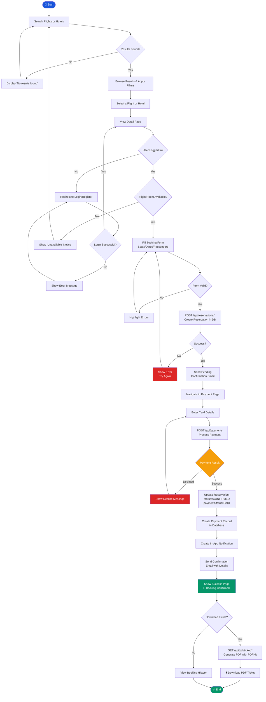

# Activity Diagram — Reservation Process

```mermaid
flowchart TD
    Start([🚀 Start]) --> Search[Search Flights or Hotels]
    Search --> Results{Results Found?}

    Results -->|No| NoResult[Display 'No results found']
    NoResult --> Search

    Results -->|Yes| Browse[Browse Results & Apply Filters]
    Browse --> Select[Select a Flight or Hotel]
    Select --> Detail[View Detail Page]

    Detail --> Auth{User Logged In?}
    Auth -->|No| Login[Redirect to Login/Register]
    Login --> LoginForm{Login Successful?}
    LoginForm -->|No| LoginError[Show Error Message]
    LoginError --> Login
    LoginForm -->|Yes| Detail

    Auth -->|Yes| Available{Flight/Room Available?}
    Available -->|No| Unavailable[Show 'Unavailable' Notice]
    Unavailable --> Search

    Available -->|Yes| BookingForm[Fill Booking Form\nSeats/Dates/Passengers]
    BookingForm --> Validate{Form Valid?}
    Validate -->|No| ValidationError[Highlight Errors]
    ValidationError --> BookingForm

    Validate -->|Yes| CreateReservation[POST /api/reservations/*\nCreate Reservation in DB]
    CreateReservation --> ReservationCreated{Success?}

    ReservationCreated -->|No| ReservationError[Show Error\nTry Again]
    ReservationError --> BookingForm

    ReservationCreated -->|Yes| SendPendingEmail[Send Pending\nConfirmation Email]
    SendPendingEmail --> PaymentPage[Navigate to Payment Page]

    PaymentPage --> PaymentForm[Enter Card Details]
    PaymentForm --> ProcessPayment[POST /api/payments\nProcess Payment]
    ProcessPayment --> PaymentResult{Payment Result}

    PaymentResult -->|Declined| PaymentError[Show Decline Message]
    PaymentError --> PaymentForm

    PaymentResult -->|Success| UpdateStatus[Update Reservation:\nstatus=CONFIRMED\npaymentStatus=PAID]
    UpdateStatus --> CreatePaymentRecord[Create Payment Record\nin Database]
    CreatePaymentRecord --> SendNotification[Create In-App Notification]
    SendNotification --> SendConfirmationEmail[Send Confirmation\nEmail with Details]

    SendConfirmationEmail --> SuccessPage[Show Success Page\n🎉 Booking Confirmed!]
    SuccessPage --> DownloadOption{Download Ticket?}

    DownloadOption -->|Yes| GeneratePDF[GET /api/pdf/ticket/*\nGenerate PDF with PDFKit]
    GeneratePDF --> DownloadPDF[⬇️ Download PDF Ticket]
    DownloadPDF --> End

    DownloadOption -->|No| ViewHistory[View Booking History]
    ViewHistory --> End([✅ End])

    style Start fill:#1a56db,color:#fff
    style End fill:#059669,color:#fff
    style PaymentResult fill:#f59e0b,color:#fff
    style SuccessPage fill:#059669,color:#fff
    style PaymentError fill:#dc2626,color:#fff
    style ReservationError fill:#dc2626,color:#fff
```
