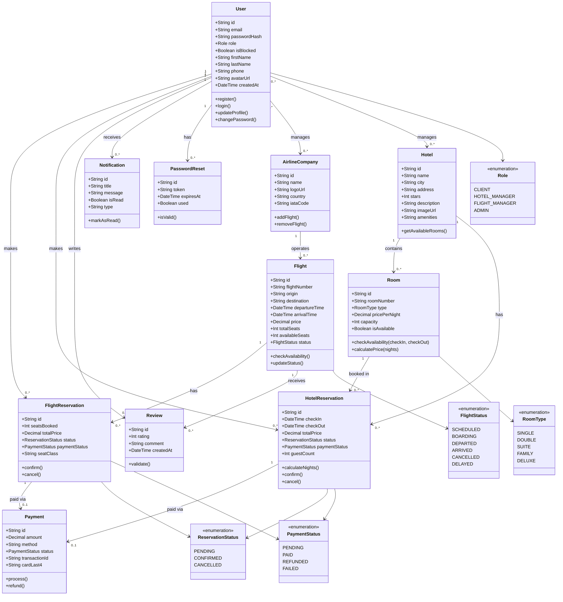

# Class Diagram — FlightHotel Booking Platform

```mermaid
classDiagram
    class User {
        +String id
        +String email
        +String passwordHash
        +Role role
        +Boolean isBlocked
        +String firstName
        +String lastName
        +String phone
        +String avatarUrl
        +DateTime createdAt
        +register()
        +login()
        +updateProfile()
        +changePassword()
    }

    class AirlineCompany {
        +String id
        +String name
        +String logoUrl
        +String country
        +String iataCode
        +addFlight()
        +removeFlight()
    }

    class Flight {
        +String id
        +String flightNumber
        +String origin
        +String destination
        +DateTime departureTime
        +DateTime arrivalTime
        +Decimal price
        +Int totalSeats
        +Int availableSeats
        +FlightStatus status
        +checkAvailability()
        +updateStatus()
    }

    class Hotel {
        +String id
        +String name
        +String city
        +String address
        +Int stars
        +String description
        +String imageUrl
        +String amenities
        +getAvailableRooms()
    }

    class Room {
        +String id
        +String roomNumber
        +RoomType type
        +Decimal pricePerNight
        +Int capacity
        +Boolean isAvailable
        +checkAvailability(checkIn, checkOut)
        +calculatePrice(nights)
    }

    class FlightReservation {
        +String id
        +Int seatsBooked
        +Decimal totalPrice
        +ReservationStatus status
        +PaymentStatus paymentStatus
        +String seatClass
        +confirm()
        +cancel()
    }

    class HotelReservation {
        +String id
        +DateTime checkIn
        +DateTime checkOut
        +Decimal totalPrice
        +ReservationStatus status
        +PaymentStatus paymentStatus
        +Int guestCount
        +calculateNights()
        +confirm()
        +cancel()
    }

    class Payment {
        +String id
        +Decimal amount
        +String method
        +PaymentStatus status
        +String transactionId
        +String cardLast4
        +process()
        +refund()
    }

    class Review {
        +String id
        +Int rating
        +String comment
        +DateTime createdAt
        +validate()
    }

    class Notification {
        +String id
        +String title
        +String message
        +Boolean isRead
        +String type
        +markAsRead()
    }

    class PasswordReset {
        +String id
        +String token
        +DateTime expiresAt
        +Boolean used
        +isValid()
    }

    %% Enums
    class Role {
        <<enumeration>>
        CLIENT
        HOTEL_MANAGER
        FLIGHT_MANAGER
        ADMIN
    }

    class FlightStatus {
        <<enumeration>>
        SCHEDULED
        BOARDING
        DEPARTED
        ARRIVED
        CANCELLED
        DELAYED
    }

    class ReservationStatus {
        <<enumeration>>
        PENDING
        CONFIRMED
        CANCELLED
    }

    class PaymentStatus {
        <<enumeration>>
        PENDING
        PAID
        REFUNDED
        FAILED
    }

    class RoomType {
        <<enumeration>>
        SINGLE
        DOUBLE
        SUITE
        FAMILY
        DELUXE
    }

    %% Relationships
    User "1" --> "0..*" FlightReservation : makes
    User "1" --> "0..*" HotelReservation : makes
    User "1" --> "0..*" Review : writes
    User "1" --> "0..*" Notification : receives
    User "1" --> "0..*" PasswordReset : has
    User "0..*" --> "0..*" AirlineCompany : manages
    User "0..*" --> "0..*" Hotel : manages

    AirlineCompany "1" --> "0..*" Flight : operates

    Flight "1" --> "0..*" FlightReservation : has
    Flight "1" --> "0..*" Review : receives

    Hotel "1" --> "0..*" Room : contains
    Hotel "1" --> "0..*" HotelReservation : has

    Room "1" --> "0..*" HotelReservation : booked in

    FlightReservation "1" --> "0..1" Payment : paid via
    HotelReservation "1" --> "0..1" Payment : paid via

    User --> Role
    Flight --> FlightStatus
    FlightReservation --> ReservationStatus
    FlightReservation --> PaymentStatus
    HotelReservation --> ReservationStatus
    HotelReservation --> PaymentStatus
    Room --> RoomType
```
