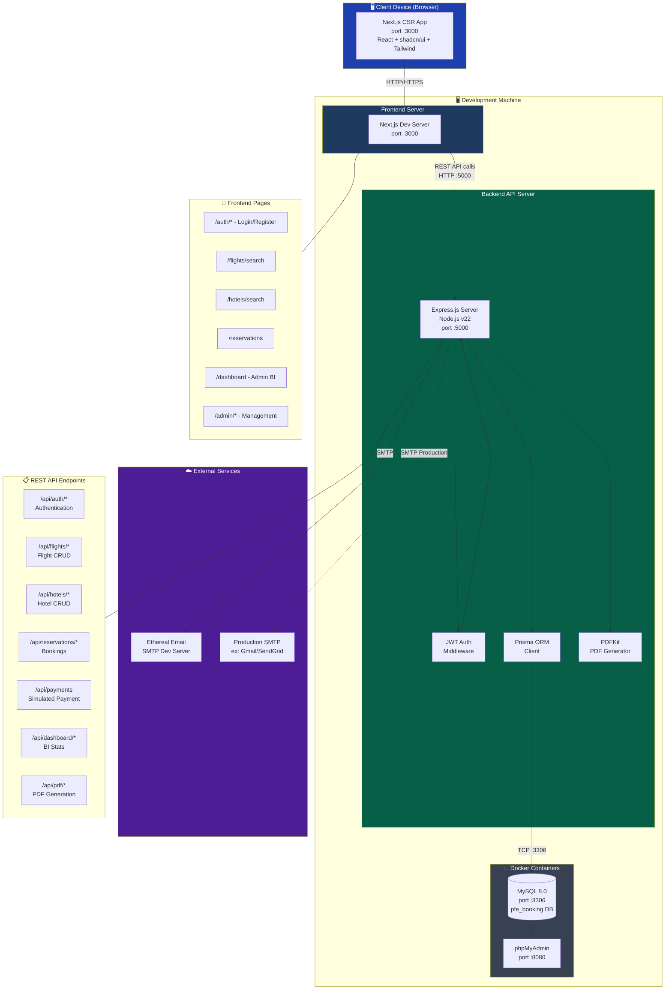

# Deployment Diagram — FlightHotel Platform Architecture

## Technology Stack

| Layer | Technology | Version |
|-------|-----------|---------|
| Frontend Framework | Next.js | 15.x |
| UI Library | shadcn/ui + Tailwind CSS | Latest |
| State Management | Zustand | 5.x |
| HTTP Client | Axios | 1.x |
| Backend Framework | Express.js | 4.x |
| Runtime | Node.js | 22.x |
| Language | TypeScript | 5.x |
| ORM | Prisma | 5.x |
| Database | MySQL | 8.0 |
| Authentication | JSON Web Tokens (JWT) | - |
| Email | Nodemailer | 6.x |
| PDF Generation | PDFKit | 0.16 |
| Charts | Recharts | 2.x |
| Containerization | Docker + Docker Compose | - |
