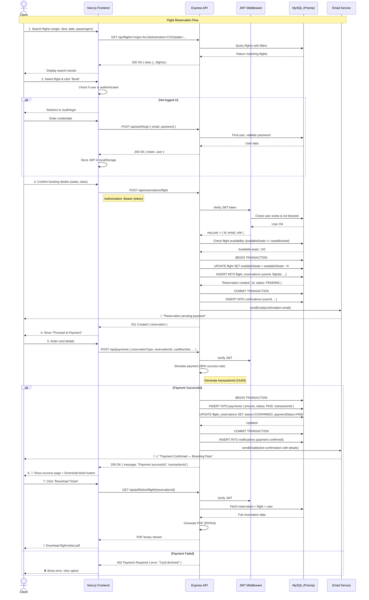

# Sequence Diagram — Flight Reservation Scenario

```mermaid
sequenceDiagram
    actor Client
    participant Frontend as Next.js Frontend
    participant API as Express API
    participant Auth as JWT Middleware
    participant DB as MySQL (Prisma)
    participant Email as Email Service

    Note over Client, Email: Flight Reservation Flow

    Client->>Frontend: 1. Search flights (origin, dest, date, passengers)
    Frontend->>API: GET /api/flights?origin=ALG&destination=CDG&date=...
    API->>DB: Query flights with filters
    DB-->>API: Return matching flights
    API-->>Frontend: 200 OK { data: [...flights] }
    Frontend-->>Client: Display search results

    Client->>Frontend: 2. Select flight & click "Book"
    Frontend->>Frontend: Check if user is authenticated
    alt Not logged in
        Frontend-->>Client: Redirect to /auth/login
        Client->>Frontend: Enter credentials
        Frontend->>API: POST /api/auth/login { email, password }
        API->>DB: Find user, validate password
        DB-->>API: User data
        API-->>Frontend: 200 OK { token, user }
        Frontend->>Frontend: Store JWT in localStorage
    end

    Client->>Frontend: 3. Confirm booking details (seats, class)
    Frontend->>API: POST /api/reservations/flight
    Note right of Frontend: Authorization: Bearer {token}
    API->>Auth: Verify JWT token
    Auth->>DB: Check user exists & not blocked
    DB-->>Auth: User OK
    Auth-->>API: req.user = { id, email, role }

    API->>DB: Check flight availability (availableSeats >= seatsBooked)
    DB-->>API: Available seats: 142

    API->>DB: BEGIN TRANSACTION
    API->>DB: UPDATE flight SET availableSeats = availableSeats - N
    API->>DB: INSERT INTO flight_reservations (userId, flightId, ...)
    DB-->>API: Reservation created { id, status: PENDING }
    API->>DB: COMMIT TRANSACTION

    API->>DB: INSERT INTO notifications (userId, ...)
    API->>Email: sendEmail(confirmation email)
    Email-->>Client: 📧 "Reservation pending payment"

    API-->>Frontend: 201 Created { reservation }
    Frontend-->>Client: 4. Show "Proceed to Payment"

    Client->>Frontend: 5. Enter card details
    Frontend->>API: POST /api/payments { reservationType, reservationId, cardNumber, ... }
    API->>Auth: Verify JWT

    API->>API: Simulate payment (90% success rate)
    Note right of API: Generate transactionId (UUID)

    alt Payment Successful
        API->>DB: BEGIN TRANSACTION
        API->>DB: INSERT INTO payments { amount, status: PAID, transactionId }
        API->>DB: UPDATE flight_reservations SET status=CONFIRMED, paymentStatus=PAID
        DB-->>API: Updated
        API->>DB: COMMIT TRANSACTION

        API->>DB: INSERT INTO notifications (payment confirmed)
        API->>Email: sendEmail(ticket confirmation with details)
        Email-->>Client: 📧 ✅ "Payment Confirmed — Boarding Pass"

        API-->>Frontend: 200 OK { message: "Payment successful", transactionId }
        Frontend-->>Client: 6. 🎉 Show success page + Download ticket button

        Client->>Frontend: 7. Click "Download Ticket"
        Frontend->>API: GET /api/pdf/ticket/flight/{reservationId}
        API->>Auth: Verify JWT
        API->>DB: Fetch reservation + flight + user
        DB-->>API: Full reservation data
        API->>API: Generate PDF (PDFKit)
        API-->>Frontend: PDF binary stream
        Frontend-->>Client: 📄 Download flight-ticket.pdf

    else Payment Failed
        API-->>Frontend: 402 Payment Required { error: "Card declined" }
        Frontend-->>Client: ❌ Show error, retry option
    end
```
