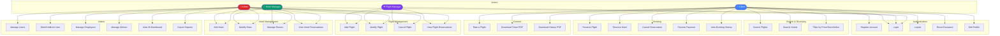

# Use Case Diagram — FlightHotel Booking Platform

```mermaid
graph TB
    subgraph Actors
        C([👤 Client])
        A([🔑 Admin])
        HM([🏨 Hotel Manager])
        FM([✈️ Flight Manager])
    end

    subgraph UC_Auth[Authentication]
        UC1[Register Account]
        UC2[Login]
        UC3[Logout]
        UC4[Reset Password]
        UC5[Edit Profile]
    end

    subgraph UC_Search[Search & Discovery]
        UC6[Search Flights]
        UC7[Search Hotels]
        UC8[Filter by Price/Stars/Airline]
    end

    subgraph UC_Booking[Booking]
        UC9[Reserve Flight]
        UC10[Reserve Hotel]
        UC11[Cancel Reservation]
        UC12[Process Payment]
        UC13[View Booking History]
    end

    subgraph UC_Content[Content]
        UC14[Rate a Flight]
        UC15[Download Ticket PDF]
        UC16[Download History PDF]
    end

    subgraph UC_FlightMgr[Flight Management]
        UC17[Add Flight]
        UC18[Modify Flight]
        UC19[Cancel Flight]
        UC20[View Flight Reservations]
    end

    subgraph UC_HotelMgr[Hotel Management]
        UC21[Add Hotel]
        UC22[Modify Hotel]
        UC23[Manage Rooms]
        UC24[View Hotel Reservations]
    end

    subgraph UC_Admin[Admin]
        UC25[Manage Users]
        UC26[Block/Unblock User]
        UC27[Manage Employees]
        UC28[Manage Airlines]
        UC29[View BI Dashboard]
        UC30[Export Reports]
    end

    %% Client relations
    C --> UC1
    C --> UC2
    C --> UC3
    C --> UC4
    C --> UC5
    C --> UC6
    C --> UC7
    C --> UC8
    C --> UC9
    C --> UC10
    C --> UC11
    C --> UC12
    C --> UC13
    C --> UC14
    C --> UC15
    C --> UC16

    %% Flight Manager relations
    FM --> UC2
    FM --> UC17
    FM --> UC18
    FM --> UC19
    FM --> UC20

    %% Hotel Manager relations
    HM --> UC2
    HM --> UC21
    HM --> UC22
    HM --> UC23
    HM --> UC24

    %% Admin relations (includes all manager permissions)
    A --> UC25
    A --> UC26
    A --> UC27
    A --> UC28
    A --> UC29
    A --> UC30
    A --> UC17
    A --> UC18
    A --> UC19
    A --> UC20
    A --> UC21
    A --> UC22
    A --> UC23
    A --> UC24

    style C fill:#3b82f6,color:#fff
    style A fill:#dc2626,color:#fff
    style HM fill:#059669,color:#fff
    style FM fill:#7c3aed,color:#fff
```
