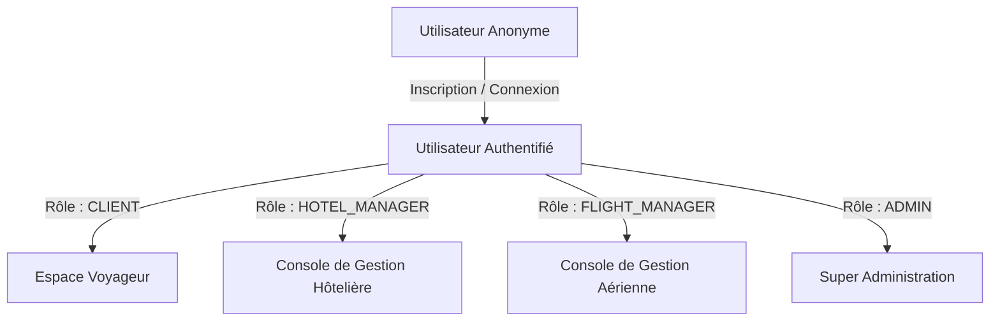

# Rapport de Projet de Fin d'Études (PFE)

## Projet : Plateforme de Réservation Unifiée de Vols & d'Hôtels (FlightHotel)

---

> [!NOTE]  
> Ce rapport technique complet détaille la conception, l'architecture logicielle, le schéma de base de données, la sécurité, ainsi que les choix d'implémentation innovants (RTL, PDFKit, multi-rôles) de la plateforme **FlightHotel**. Il a été rédigé pour servir de documentation de soutenance de PFE.

---

## Table des Matières
1. [Introduction & Contexte](#1-introduction--contexte)
2. [Analyse Fonctionnelle & Rôles (RBAC)](#2-analyse-fonctionnelle--rôles-rbac)
3. [Architecture Logicielle & Stack Technique](#3-architecture-logicielle--stack-technique)
4. [Schéma et Modélisation de la Base de Données](#4-schéma-et-modélisation-de-la-base-de-données)
5. [Moteur de Traduction Dynamique & Support RTL](#5-moteur-de-traduction-dynamique--support-rtl)
6. [Récupération de Mot de Passe & Flux Mailtrap SMTP](#6-récupération-de-mot-de-passe--flux-mailtrap-smtp)
7. [Module de Paiement & Génération PDF de Factures](#7-module-de-paiement--génération-pdf-de-factures)
8. [Sécurité, Protection de l'API & Déploiement](#8-sécurité-protection-de-lapi--déploiement)
9. [Conclusion & Perspectives d'Évolution](#9-conclusion--perspectives-dévolution)

---

## 1. Introduction & Contexte

Dans le secteur du tourisme et du voyage numérique, les utilisateurs sont souvent contraints de naviguer entre plusieurs plateformes pour réserver un vol et un hébergement. Cela nuit à l'expérience utilisateur et complexifie la planification logistique.

**FlightHotel** est une solution unifiée (Software as a Service - SaaS) combinant dans une interface fluide et moderne la recherche de vols aériens et de chambres d'hôtels, la gestion des paniers, l'émission de titres de transport et d'hébergement (billets et bons de réservation), ainsi qu'une console d'administration multi-rôle distribuée.

---

## 2. Analyse Fonctionnelle & Rôles (RBAC)

La plateforme intègre un contrôle d'accès strict basé sur les rôles (**RBAC - Role-Based Access Control**) afin de compartimenter les données et sécuriser les interactions de chaque acteur :



### Grille détaillée des droits d'accès :
*   **CLIENT (Voyageur)** :
    *   Recherche multicritère de vols (origine, destination, date, passagers) et d'hôtels (ville, dates, nombre de chambres).
    *   Réservation temporaire et paiement simulé sécurisé (simulation de passerelle de paiement).
    *   Génération et téléchargement de billets PDF (cartes d'embarquement) et de bons de réservation d'hôtels (vouchers).
    *   Rédaction d'avis (ratings & reviews) avec notation par étoiles.
    *   Historique personnel et annulation de réservations.
*   **HOTEL_MANAGER (Gestionnaire d'Hôtel)** :
    *   Accès à un tableau de bord dédié récapitulant les chambres disponibles et occupées de ses établissements.
    *   Gestion des chambres (ajout, modification du prix/capacité, suppression).
    *   Visualisation et annulation des réservations hôtelières affectant uniquement ses établissements attitrés.
*   **FLIGHT_MANAGER (Gestionnaire de Vols)** :
    *   Tableau de bord listant les vols actifs et le taux de remplissage des avions de sa compagnie aérienne.
    *   Suivi des réservations et modification des statuts de vols.
*   **ADMIN (Super Administrateur)** :
    *   Contrôle absolu sur l'ensemble de la base de données.
    *   Gestion complète des utilisateurs (création de gestionnaires, blocage ou déblocage de comptes).
    *   Création et modification des compagnies aériennes, vols, hôtels, et chambres.
    *   Accès global aux statistiques financières (chiffre d'affaires de la plateforme, répartition par établissement).

---

## 3. Architecture Logicielle & Stack Technique

L'application repose sur un découpage strict **Client-Serveur (API-First)** pour garantir l'évolutivité et la maintenabilité du système :

```mermaid
graph LR
    subgraph Client [Application Frontend (Client)]
        NextJS[Next.js 14+ App Router]
        Zustand[Zustand Store]
        ReactQuery[React Query (TanStack)]
    end

    subgraph Serveur [Application Backend (API)]
        Express[Express.js Engine]
        Prisma[Prisma Client ORM]
    end

    subgraph Infrastructures [Services Externes]
        MySQL[(Base de Données MySQL)]
        SMTP[Serveur SMTP Mailtrap]
    end

    NextJS <-->|HTTP REST / JSON| Express
    Express <-->|Prisma ORM| MySQL
    Express <-->|Nodemailer| SMTP
```

### Le Frontend (Client)
*   **Next.js 14+ (App Router)** : Utilisation des fonctionnalités avancées de Next.js (optimisation du rendu client, routage déclaratif, dossiers dynamiques).
*   **Tailwind CSS** : Utilisé pour l'ensemble de la mise en page, permettant une interface responsive rapide, supportant les préfixes de direction RTL pour l'arabe (`rtl:text-right`, `rtl:ml-2`, etc.) et dotée d'une charte graphique premium style **Glassmorphism** (effet verre dépoli, ombres portées douces, et micro-animations fluides).
*   **Zustand** : Une bibliothèque de gestion d'état globale minimaliste et rapide, utilisée pour maintenir l'état d'authentification de l'utilisateur, son profil et ses tokens JWT de session sans réévaluation inutile du DOM.
*   **React Query (TanStack Query v5)** : Utilisé pour la synchronisation asynchrone des données de l'API, gérant le cache automatique, les rafraîchissements en arrière-plan et la gestion des états de chargement/mutation.

### Le Backend (API Serveur)
*   **Node.js & TypeScript** : Environnement d'exécution robuste et typé pour une détection précoce des bugs lors de la compilation.
*   **Express.js** : Framework minimaliste et rapide pour structurer les routes REST, les contrôleurs et les pipelines de middlewares.
*   **Prisma ORM** : Mapping relationnel objet de nouvelle génération, permettant des migrations de schéma automatisées, un typage fort des requêtes et un accès performant à la base de données relationnelle.
*   **MySQL** : Système de gestion de base de données relationnelle choisi pour la rigueur des transactions ACID et sa robustesse en production.

---

## 4. Schéma et Modélisation de la Base de Données

Le schéma de base de données a été modélisé à l'aide de Prisma ORM. Les relations garantissent l'intégrité référentielle en cas de suppression en cascade ou de modification.

```prisma
datasource db {
  provider = "mysql"
  url      = env("DATABASE_URL")
}

generator client {
  provider = "prisma-client-js"
}

enum Role {
  CLIENT
  HOTEL_MANAGER
  FLIGHT_MANAGER
  ADMIN
}

enum FlightStatus {
  SCHEDULED
  BOARDING
  DEPARTED
  ARRIVED
  CANCELLED
  DELAYED
}

enum RoomType {
  SINGLE
  DOUBLE
  SUITE
  DELUXE
}

enum BookingStatus {
  PENDING
  CONFIRMED
  CANCELLED
}

enum PaymentStatus {
  PENDING
  PAID
  REFUNDED
  FAILED
}

model User {
  id                String              @id @default(uuid())
  email             String              @unique
  passwordHash      String
  firstName         String
  lastName          String
  phone             String?
  avatarUrl         String?
  role              Role                @default(CLIENT)
  isBlocked         Boolean             @default(false)
  createdAt         DateTime            @default(now())
  updatedAt         DateTime            @updatedAt
  
  managedHotels     Hotel[]             @relation("HotelManager")
  managedAirlines   AirlineCompany[]    @relation("AirlineManager")
  flightBookings    FlightReservation[]
  hotelBookings     HotelReservation[]
  notifications     Notification[]
  reviews           Review[]
  passwordResets    PasswordReset[]

  @@map("users")
}

model AirlineCompany {
  id        String   @id @default(uuid())
  name      String
  logoUrl   String?
  country   String
  iataCode  String   @unique
  createdAt DateTime @default(now())
  
  managers  User[]   @relation("AirlineManager")
  flights   Flight[]

  @@map("airline_companies")
}

model Flight {
  id             String              @id @default(uuid())
  airlineId      String
  flightNumber   String              @unique
  origin         String
  destination    String
  departureTime  DateTime
  arrivalTime    DateTime
  price          Decimal             @db.Decimal(10, 2)
  totalSeats     Int
  availableSeats Int
  status         FlightStatus        @default(SCHEDULED)
  createdAt      DateTime            @default(now())
  
  airline        AirlineCompany      @relation(fields: [airlineId], references: [id], onDelete: Cascade)
  reservations   FlightReservation[]
  reviews        Review[]

  @@map("flights")
}

model Hotel {
  id           String             @id @default(uuid())
  name         String
  city         String
  address      String
  stars        Int                @default(3)
  description  String             @db.Text
  imageUrl     String?
  amenities    String             @default("[]") // Tableau JSON stocké sous forme de chaîne
  managerId    String
  createdAt    DateTime           @default(now())
  
  manager      User               @relation("HotelManager", fields: [managerId], references: [id], onDelete: Restrict)
  rooms        Room[]
  reservations HotelReservation[]

  @@map("hotels")
}

model Room {
  id           String             @id @default(uuid())
  hotelId      String
  roomNumber   String
  type         RoomType           @default(SINGLE)
  pricePerNight Decimal            @db.Decimal(10, 2)
  capacity     Int                @default(1)
  isAvailable  Boolean            @default(true)
  createdAt    DateTime           @default(now())
  
  hotel        Hotel              @relation(fields: [hotelId], references: [id], onDelete: Cascade)
  reservations HotelReservation[]

  @@map("rooms")
}

model FlightReservation {
  id            String        @id @default(uuid())
  userId        String
  flightId      String
  seatsBooked   Int           @default(1)
  seatClass     String        @default("ECONOMY")
  passengerInfo String        @db.Text // JSON stringifié contenant les détails des passagers
  totalPrice    Decimal       @db.Decimal(10, 2)
  status        BookingStatus @default(PENDING)
  paymentStatus PaymentStatus @default(PENDING)
  createdAt     DateTime      @default(now())
  
  user          User          @relation(fields: [userId], references: [id], onDelete: Cascade)
  flight        Flight        @relation(fields: [flightId], references: [id], onDelete: Cascade)
  payments      Payment[]     @relation("FlightPayments")

  @@map("flight_reservations")
}

model HotelReservation {
  id            String        @id @default(uuid())
  userId        String
  hotelId       String
  roomId        String
  checkIn       DateTime
  checkOut      DateTime
  guestCount    Int           @default(1)
  totalPrice    Decimal       @db.Decimal(10, 2)
  status        BookingStatus @default(PENDING)
  paymentStatus PaymentStatus @default(PENDING)
  createdAt     DateTime      @default(now())
  
  user          User          @relation(fields: [userId], references: [id], onDelete: Cascade)
  hotel         Hotel         @relation(fields: [hotelId], references: [id], onDelete: Cascade)
  room          Room          @relation(fields: [roomId], references: [id], onDelete: Cascade)
  payments      Payment[]     @relation("HotelPayments")

  @@map("hotel_reservations")
}

model Payment {
  id                  String             @id @default(uuid())
  amount              Decimal            @db.Decimal(10, 2)
  method              String             @default("CARD") // CARD, PAYPAL
  status              PaymentStatus      @default(PENDING)
  transactionId       String             @unique
  flightReservationId String?
  hotelReservationId  String?
  createdAt           DateTime           @default(now())
  
  flightReservation   FlightReservation? @relation("FlightPayments", fields: [flightReservationId], references: [id], onDelete: Cascade)
  hotelReservation    HotelReservation?  @relation("HotelPayments", fields: [hotelReservationId], references: [id], onDelete: Cascade)

  @@map("payments")
}

model Notification {
  id        String   @id @default(uuid())
  userId    String
  title     String
  message   String
  isRead    Boolean  @default(false)
  createdAt DateTime @default(now())
  
  user      User     @relation(fields: [userId], references: [id], onDelete: Cascade)

  @@map("notifications")
}

model PasswordReset {
  id        String   @id @default(uuid())
  userId    String
  token     String   @unique
  expiresAt DateTime
  createdAt DateTime @default(now())
  
  user      User     @relation(fields: [userId], references: [id], onDelete: Cascade)

  @@map("password_resets")
}

model Review {
  id        String   @id @default(uuid())
  userId    String
  flightId  String?
  rating    Int      @default(5)
  comment   String   @db.Text
  createdAt DateTime @default(now())
  
  user      User     @relation(fields: [userId], references: [id], onDelete: Cascade)
  flight    Flight?  @relation(fields: [flightId], references: [id], onDelete: Cascade)

  @@map("reviews")
}

---

## 5. Moteur de Traduction Dynamique & Support RTL

Afin de répondre à des exigences de dimension internationale et d'offrir une expérience utilisateur de premier ordre, nous avons implémenté un moteur d'internationalisation (i18n) personnalisé côté client.

### Architecture Technique de la Traduction
L'internationalisation n'utilise pas de librairie lourde tierce, mais repose sur un **React Context** léger optimisé :
*   **LanguageProvider ([LanguageContext.tsx](file:///c:/Users/amine/Desktop/PFE%20Project%20%20D-4%20V2/frontend/context/LanguageContext.tsx))** : Encapsule l'arborescence de l'application. Il maintient l'état de la langue active (`fr` par défaut, `en`, `ar`) et synchronise automatiquement ce choix avec le `localStorage` du navigateur.
*   **Résolution récursive des clés** : La fonction `t(path, params)` permet de traduire des chaînes imbriquées (ex. `t('common.navbar.home')`) et gère le remplacement dynamique de paramètres (ex. `{count} places` ou `{price} $`).
*   **Support RTL (Right-To-Left) pour l'Arabe** :
    *   Lors du passage à la langue arabe, un `useEffect` modifie dynamiquement la racine du document : `document.documentElement.dir = 'rtl'` et `document.documentElement.lang = 'ar'`.
    *   La mise en page s'inverse automatiquement grâce à l'utilisation combinée de flexbox bidirectionnels et de directives Tailwind CSS orientées direction (`rtl:text-right`, `rtl:flex-row-reverse`, `rtl:space-x-reverse`, etc.).
    *   Le sélecteur de langue dans la barre de navigation ([Navbar.tsx](file:///c:/Users/amine/Desktop/PFE%20Project%20%20D-4%20V2/frontend/components/layout/Navbar.tsx)) adapte le positionnement de son menu déroulant (`isRtl ? 'left-0' : 'right-0'`) pour éviter tout débordement de l'écran.

---

## 6. Récupération de Mot de Passe & Flux Mailtrap SMTP

La sécurité des accès utilisateur implique un mécanisme de récupération de compte fiable en cas d'oubli de mot de passe.

### Algorithme du Flux de Récupération
1.  **Demande initiale** : L'utilisateur renseigne son adresse e-mail sur la page `/auth/forgot-password`.
2.  **Génération du jeton (Token)** : Le serveur backend vérifie l'existence du compte, génère un jeton cryptographique aléatoire unique (UUIDv4) et l'enregistre dans la table `PasswordReset` avec une validité temporelle limitée à 1 heure (`expiresAt`).
3.  **Expédition de l'E-mail** : Le serveur utilise **Nodemailer** configuré avec le relais SMTP sécurisé de **Mailtrap** pour envoyer un courriel HTML formaté contenant le lien dynamique :
    `http://localhost:3000/auth/reset-password?token=<TOKEN>`
4.  **Changement effectif** : La page `/auth/reset-password` côté client récupère le jeton dans l'URL, invite l'utilisateur à saisir son nouveau mot de passe (avec validation stricte de schéma Zod de 6 caractères minimum), et soumet le tout au serveur. Le serveur valide le jeton en base, met à jour le mot de passe après hachage par **bcrypt**, puis invalide (supprime) le jeton utilisé.

---

## 7. Module de Paiement & Génération PDF de Factures

Une fois le vol ou l'hôtel choisi par le client, la plateforme initie un processus transactionnel fluide.

### Processus Transactionnel & Facturation
*   **Simulateur de Paiement ([payment/page.tsx](file:///c:/Users/amine/Desktop/PFE%20Project%20%20D-4%20V2/frontend/app/payment/page.tsx))** : Prend en charge la simulation de transactions par carte bancaire ou par PayPal. Les entrées sont validées rigoureusement sur le client (longueur du numéro de carte, date d'expiration, CVV).
*   **Génération PDF Côté Client ([generatePDF.ts](file:///c:/Users/amine/Desktop/PFE%20Project%20%20D-4%20V2/frontend/lib/generatePDF.ts))** :
    *   À l'aide de bibliothèques de manipulation de PDF, l'application génère dynamiquement des documents PDF professionnels (billets d'avion et bons d'hôtel).
    *   Ces documents intègrent des polices modernes, la mise en page des informations du passager, le récapitulatif financier, des instructions de vol/séjour et un **QR Code** de sécurité unique généré à la volée représentant l'ID de la transaction pour faciliter le contrôle au guichet ou à la réception.

---

## 8. Sécurité, Protection de l'API & Déploiement

La sécurité est une priorité transversale sur l'ensemble de l'architecture :
*   **Authentification Stateless (sans état)** : Utilisation de jetons **JSON Web Tokens (JWT)** signés avec une clé secrète asymétrique, assurant l'authentification sécurisée de chaque requête API via des en-têtes d'autorisation HTTP.
*   **Protection des Routes (RBAC Middleware)** : Des middlewares Express interceptent les requêtes et bloquent les accès non autorisés (ex : un manager d'hôtel tentant d'accéder aux réservations d'un vol). Les requêtes sont filtrées dynamiquement en base de données selon l'identité de l'utilisateur connecté (`req.user.id`).
*   **Limitation de Débit (Rate Limiting)** : Protection contre les attaques par force brute (sur les routes de connexion) et les attaques par déni de service (DDoS) à l'aide de règles de limitation d'appels Express Rate Limit.
*   **Validation et Assainissement des Données** : Les requêtes entrantes sont passées au crible d'Express Validator sur le backend pour neutraliser les injections SQL et failles XSS, tandis que Zod valide les formats de formulaires côté client.

---

## 9. Conclusion & Perspectives d'Évolution

La plateforme **FlightHotel** démontre l'efficacité d'une architecture moderne découplée pour gérer des flux transactionnels complexes en temps réel. Grâce au système multi-langue et RTL intégré, l'application est prête pour un déploiement international.

### Évolutions Futures Planifiées
1.  **WebSockets** : Intégration de connexions bidirectionnelles en temps réel pour la mise à jour instantanée de la grille des sièges d'avions et de l'état d'occupation des chambres.
2.  **Passerelle Réelle** : Remplacement du module de paiement simulé par un kit SDK Stripe ou un processeur de paiement bancaire réel en production.
3.  **IA & Recommandation** : Intégration d'un algorithme d'apprentissage automatique pour proposer des offres d'hôtels adaptées aux destinations de vols recherchées par le voyageur.

